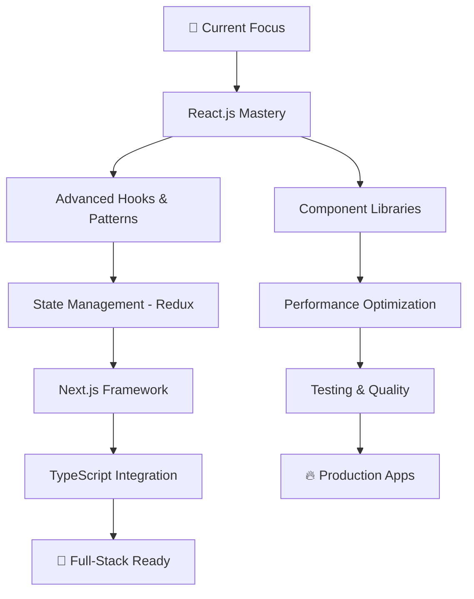

# 🚀 Keerthi Raj S

<div align="center">
  


</div>

<div align="center">
  
</div>

## 🌟 About Me

<table align="center">
<tr>
<td width="50%">

### 🎯 **Current Status**
```typescript
const keerthi = {
  title: "Frontend Developer",
  education: "B.Tech IT @ SRM Institute",
  graduation: 2026,
  currentFocus: ["React.js", "Machine Learning", "DSA"],
  streak: "130+ days on LeetCode 🔥",
  mindset: "Always learning, always building"
};
````

\</td\>
\<td align="center" width="50%"\>

### 📊 **Quick Stats**

  - ⚛️ **React.js Specialist** - Modern Web Dev
  - 🐍 **Python Enthusiast** - ML & Backend
  - 🧠 **Problem Solver** - 130+ LeetCode streak
  - 🎨 **UI/UX Focused** - Clean, Modern Designs

\</td\>
\</tr\>
\</table\>

-----

## 💼 Tech Arsenal

\<div align="center"\>

### **Frontend Mastery**

\<p\>
  \
\</p\>

### **Backend & Tools**

\<p\>
  \
\</p\>

### **Currently Mastering**

\<p\>
  \
\</p\>

\</div\>

-----

## 📈 GitHub Analytics

\<div align="center"\>
  \<table\>
    \<tr\>
      \<td width="50%"\>
        \
      \</td\>
      \<td width="50%"\>
        \
      \</td\>
    \</tr\>
    \<tr\>
      \<td width="50%"\>
        \
      \</td\>
      \<td width="50%"\>
        \
      \</td\>
    \</tr\>
  \</table\>
\</div\>

\<div align="center"\>
  \
\</div\>

-----

## 🎯 Featured Projects

\<div align="center"\>
  \<table\>
    \<tr\>
      \<td width="50%" align="center"\>
        \<h3\>🤖 Fake Social Media Detection\</h3\>
        \<p\>\<em\>AI-powered system to identify fake social media accounts\</em\>\</p\>
        \<p\>
          \
          \
          \
        \</p\>
        \<details\>
          \<summary\>\<strong\>🔍 Technical Deep Dive\</strong\>\</summary\>
          \<br\>
          • Machine Learning for pattern detection\<br\>
          • Flask REST API backend\<br\>
          • Data processing and analysis\<br\>
          • Simple but effective ML implementation
        \</details\>
      \</td\>
      \<td width="50%" align="center"\>
        \<h3\>💳 Credit Card Fraud Detection\</h3\>
        \<p\>\<em\>Full-stack solution for real-time fraud detection\</em\>\</p\>
        \<p\>
          \
          \
          \
        \</p\>
        \<details\>
          \<summary\>\<strong\>🔍 Technical Deep Dive\</strong\>\</summary\>
          \<br\>
          • React.js with modern hooks & functional components\<br\>
          • Responsive UI with Tailwind CSS\<br\>
          • REST API integration with Flask backend\<br\>
          • Clean component architecture & state management
        \</details\>
      \</td\>
    \</tr\>
  \</table\>
\</div\>

-----

## 🎨 Skills Breakdown

\<div align="center"\>
\<table\>
\<tr\>
\<td width="33%" valign="top"\>
\<h3 align="center"\>🎨 Frontend\</h3\>

**Frontend Mastery**

  - ⚛️ React Hooks & Context
  - 🔄 State Management (Redux)
  - 🎯 Component Architecture
  - 🧪 Testing (Jest, RTL)

**Styling & Design**

  - 🎨 Tailwind CSS Expert

  - 💅 Modern CSS

  - 📱 Responsive Design

  - ✨ CSS Animations

    \</td\>
    \<td width="33%" valign="top"\>
    \<h3 align="center"\>🔧 Backend (Learning)\</h3\>

**Python Basics**

  - 🐍 Flask for APIs
  - 📊 Basic Data Handling
  - 🔗 REST API Integration
  - 🗄️ MySQL Database

**Tools I Use**

  - 🔧 Git & GitHub

  - 💻 VS Code

  - 📡 Postman for APIs

  - 🎯 Learning Backend Concepts

    \</td\>
    \<td width="33%" valign="top"\>
    \<h3 align="center"\>🧠 Problem Solving\</h3\>

**Competitive Programming**

  - 💪 130+ day LeetCode streak
  - 🏆 HackerRank certified
  - 🔍 Algorithm optimization
  - 📈 Data Structures mastery

**Learning & Growth**

  - 📚 Continuous learner

  - 🤝 Team collaboration

  - 🎯 Solution-oriented mindset

  - 🚀 Innovation focused

    \</td\>
    \</tr\>

\</table\>
\</div\>

-----

## 🎯 Current Learning Path

\<div align="center"\>



\</div\>

**🎯 2025 Goals:**

  - ⚛️ Master advanced React patterns & hooks
  - 🏗️ Build 5+ production-ready React apps
  - 📱 Learn React Native for mobile
  - 🚀 Contribute to React open source projects

-----

## 📊 Coding Activity

\<div align="center"\>

```text
JavaScript   ████████████████████   78.5%
React        ███████████████████░   75.2%
HTML/CSS     ██████████░░░░░░░░░░   42.8%
Python       ████████░░░░░░░░░░░░   32.1%
Tailwind     ██████░░░░░░░░░░░░░░   28.3%
```

\</div\>

-----

## 🌐 Connect & Collaborate

\<div align="center"\>

**💬 Let's build something amazing together\!**

\<p\>
  \<a href="https://www.linkedin.com/in/keerthi-raj-s-74a8a824b/"\>
    \
  \</a\>
  \<a href="mailto:keerthirajsivashankar@gmail.com"\>
    \
  \</a\>
  \<a href="https://keerthirajsivashankar.github.io/Portfolio/"\>
    \
  \</a\>
\</p\>

\<p\>
  \<a href="https://leetcode.com/u/keerthiraj\_s/"\>
    \
  \</a\>
  \<a href="https://www.hackerrank.com/profile/ks7186"\>
    \
  \</a\>
  \<a href="https://www.codechef.com/users/keerthi\_raj"\>
    \
  \</a\>
\</p\>

\</div\>

-----

## 🌟 Fun Facts & Inspiration

\<div align="center"\>
  \<table\>
    \<tr\>
      \<td align="center"\>
        \<h3\>💡 Philosophy\</h3\>
        \<em\>"Code is poetry written in logic"\</em\>
        \<br\>\<br\>
        🎯 Always aiming for clean, maintainable code\<br\>
        🌱 Believer in continuous learning\<br\>
        🤝 Passionate about solving real-world problems\<br\>
        🚀 Excited about the future of web development
      \</td\>
      \<td align="center"\>
        \<h3\>🎵 When I'm Not Coding\</h3\>
        🏃‍♂️ Maintaining fitness routines\<br\>
        📚 Reading tech blogs & documentation\<br\>
        🎮 Exploring new frameworks & tools\<br\>
        🌟 Contributing to open source\<br\>
        💡 Brainstorming project ideas
      \</td\>
    \</tr\>
  \</table\>
\</div\>

-----

\<div align="center"\>

### 📈 Profile Views

\

### 💭 Daily Inspiration

\

\</div\>

-----

\<div align="center"\>
  \
 
  **⭐ "Building the future, one commit at a time" ⭐**
 
  \<sub\>💡 Open for collaborations • 🚀 Available for freelance projects • 🌟 Always learning\</sub\>
\</div\>

```

