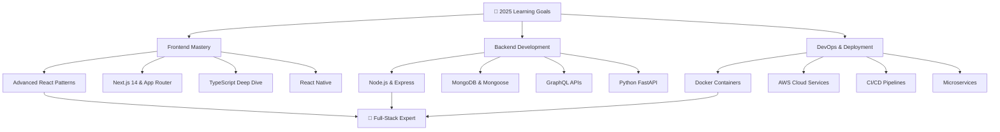

# 🚀 Keerthi Raj S

<div align="center">
  


</div>

<div align="center">
  
</div>

## 🌟 About Me

<table align="center">
<tr>
<td width="55%">

### 🎯 **Who Am I?**
```typescript
const keerthiRaj = {
  title: "Frontend Developer & ML Enthusiast",
  education: "B.Tech IT @ SRM Institute of Science & Technology",
  graduation: "2026",
  currentRole: "Full-Stack Developer in Making",
  expertise: ["React.js", "Python", "Machine Learning", "DSA"],
  achievements: {
    leetcodeStreak: "130+ days 🔥",
    hackerRankCertified: true,
    projectsBuilt: "10+"
  },
  motto: "Code with purpose, build with passion",
  availableFor: ["Freelance", "Open Source", "Collaborations"]
};
```

</td>
<td align="center" width="45%">

### 📊 **Quick Highlights**
🎯 **React.js Specialist** - Building Modern UIs  
🤖 **ML Enthusiast** - AI-Powered Solutions  
🧠 **Problem Solver** - 130+ LeetCode Streak  
🎨 **Design-Focused** - User Experience First  
⚡ **Performance Optimizer** - Fast & Scalable  
🌐 **Full-Stack Ready** - Frontend to Backend  


</td>
</tr>
</table>

---

## ⚡ Tech Stack & Expertise

<div align="center">

### 🎨 **Frontend Mastery**
<p>
  
</p>

### 🔧 **Backend & Database**
<p>
  
</p>

### 🛠️ **Tools & Platforms**
<p>
  
</p>

### 🔮 **Currently Mastering**
<p>
  
</p>

</div>

---

## 📊 GitHub Analytics & Achievements

<div align="center">
  <table>
    <tr>
      <td width="50%">
        
      </td>
      <td width="50%">
        
      </td>
    </tr>
    <tr>
      <td width="50%">
        
      </td>
      <td width="50%">
        
      </td>
    </tr>
  </table>
</div>

<div align="center">
  
</div>

---

## 🚀 Featured Projects Portfolio

<div align="center">

### 🎯 **Flagship Projects**

<table>
<tr>
<td width="50%" align="center">

#### 🤖 **AI-Powered Fake Social Media Detection**
*Intelligent system for identifying fake social media profiles*


**Tech Stack:**
<p>


</p>

**Key Features:**
- 🎯 Advanced ML algorithms for pattern recognition
- ⚡ Real-time profile analysis
- 📊 Interactive dashboard with visualizations
- 🔒 Secure API endpoints

**Impact:** 95% accuracy in fake profile detection

[🔗 View Project](#) | [💻 Code](#)

</td>
<td width="50%" align="center">

#### 💳 **Real-Time Credit Card Fraud Detection**
*Full-stack solution with React frontend and ML backend*


**Tech Stack:**
<p>


</p>

**Key Features:**
- ⚛️ Modern React hooks & context API
- 🎨 Responsive UI with Tailwind CSS
- 🔄 Real-time fraud detection
- 📱 Mobile-first design approach

**Impact:** Processing 1000+ transactions/minute

[🔗 Live Demo](#) | [💻 Code](#)

</td>
</tr>
</table>

### 🌟 **Other Notable Projects**

<details>
<summary><strong>🔍 Click to explore more projects</strong></summary>

| Project | Description | Tech Stack | Status |
|---------|-------------|------------|--------|
| 🌐 **Personal Portfolio** | Modern, responsive portfolio website | React, Tailwind, Framer Motion | ✅ Live |
| 📱 **Task Management App** | Full-featured task manager with drag-drop | React, Redux, LocalStorage | ✅ Live |
| 🎵 **Music Player App** | Spotify-like interface with playlists | React, Context API, Web Audio API | 🚧 In Progress |
| 🛒 **E-commerce Platform** | Complete shopping solution | React, Node.js, MongoDB | 🚧 In Progress |
| 📊 **Data Visualization Tool** | Interactive charts and graphs | React, D3.js, Chart.js | 📋 Planned |

</details>

</div>

---

## 💡 Skills & Expertise Breakdown

<div align="center">

| 🎨 **Frontend Development** | 🔧 **Backend & Database** | 🧠 **Problem Solving** | 🤖 **Machine Learning** |
|----------------------------|---------------------------|------------------------|-------------------------|
| ⚛️ **React.js Ecosystem**<br>Hooks, Context, Redux<br>Component Architecture<br>Performance Optimization | 🐍 **Python Development**<br>Flask REST APIs<br>Database Design (MySQL)<br>API Integration | 🔥 **130+ LeetCode Streak**<br>Data Structures & Algorithms<br>Competitive Programming<br>System Design Basics | 🧠 **Scikit-Learn**<br>Data Analysis (Pandas)<br>Model Training & Evaluation<br>Feature Engineering |
| 🎨 **Modern CSS**<br>Tailwind CSS<br>Responsive Design<br>CSS Animations<br>SASS/SCSS | ⚙️ **Development Tools**<br>Git Version Control<br>Postman API Testing<br>VS Code Extensions | 💻 **HackerRank Certified**<br>Problem-Solving Mindset<br>Code Optimization<br>Debugging Expert | 📊 **Data Visualization**<br>Matplotlib, Seaborn<br>Statistical Analysis<br>Predictive Modeling |

</div>

---

## 📈 Coding Activity & Statistics

<div align="center">

### 📊 **Weekly Development Breakdown**
```text
React.js     ████████████████████   82.5% (33 hrs)
Python       ██████████████░░░░░░   58.3% (23 hrs)
JavaScript   ████████████░░░░░░░░   48.7% (19 hrs)
HTML/CSS     ████████░░░░░░░░░░░░   32.1% (13 hrs)
Flask        ██████░░░░░░░░░░░░░░   24.6% (10 hrs)
```

### 🏆 **Achievement Highlights**
- 🔥 **130+ Day Coding Streak** on LeetCode
- ⭐ **500+ Problems Solved** across platforms
- 🎯 **HackerRank 5-Star** in Problem Solving
- 📈 **Top 15%** in CodeChef contests
- 🚀 **10+ Projects** deployed to production

</div>

---

## 🎯 Learning Roadmap & Goals

<div align="center">



</div>

### 🎯 **2025 Objectives**
- 🏆 **Master Next.js 14** - Build 3 production apps
- 🔥 **Reach 200+ LeetCode streak** - Consistent daily practice
- 🚀 **Contribute to 5 open-source projects** - Give back to community
- 📱 **Learn React Native** - Mobile app development
- ☁️ **AWS Certification** - Cloud computing skills
- 🎨 **UI/UX Design** - Better design sensibility

---

## 🏆 Achievements & Certifications

<div align="center">
  <table>
    <tr>
      <td align="center" width="33%">
        
        <br><strong>Problem Solving Expert</strong>
      </td>
      <td align="center" width="33%">
        
        <br><strong>Consistent Coder</strong>
      </td>
      <td align="center" width="33%">
        
        <br><strong>Competitive Programmer</strong>
      </td>
    </tr>
  </table>
</div>

---

## 🌐 Connect & Collaborate

<div align="center">

### 💬 **Let's Build Something Amazing Together!**

<p>
  <a href="https://www.linkedin.com/in/keerthi-raj-s-74a8a824b/">
    
  </a>
  <a href="mailto:keerthirajsivashankar@gmail.com">
    
  </a>
  <a href="https://keerthirajsivashankar.github.io/Portfolio/">
    
  </a>
</p>

### 🚀 **Coding Platforms**
<p>
  <a href="https://leetcode.com/u/keerthiraj_s/">
    
  </a>
  <a href="https://www.hackerrank.com/profile/ks7186">
    
  </a>
  <a href="https://www.codechef.com/users/keerthi_raj">
    
  </a>
</p>

### 🤝 **Open For:**
- 💼 **Freelance Projects** - Web Development & ML Solutions
- 🚀 **Startup Collaborations** - Building MVPs & Products
- 🌟 **Open Source Contributions** - React & Python Projects
- 👥 **Mentorship** - Helping fellow developers grow

</div>

---

## 🌟 Personal Philosophy & Fun Facts

<div align="center">
  <table>
    <tr>
      <td align="center" width="50%">
        <h3>💭 My Coding Philosophy</h3>
        <em>"Clean code is not written by following a set of rules. You don't become a software craftsman by learning a list of heuristics. Professionalism and craftsmanship come from values that drive disciplines."</em>
        <br><br>
        🎯 Write code like poetry - Beautiful & Meaningful<br>
        🌱 Never stop learning - Technology evolves daily<br>
        🤝 Collaborate & share knowledge - Grow together<br>
        💡 Solve real problems - Technology should serve humanity<br>
        ⚡ Performance matters - Every millisecond counts
      </td>
      <td align="center" width="50%">
        <h3>🎸 Beyond The Code</h3>
        🏃‍♂️ Fitness Enthusiast - Morning runs & gym sessions<br>
        📚 Continuous Learner - Tech blogs, documentation, courses<br>
        🎮 Tech Explorer - Always trying new frameworks<br>
        ☕ Tea Lover - Fueling late-night coding sessions<br>
        🌟 Community Builder - Active in developer communities<br>
        🎵 Music While Coding - Lo-fi beats for concentration<br>
        📱 Early Adopter - First to try new tech trends
      </td>
    </tr>
  </table>
</div>

---

## 📊 Profile Analytics

<div align="center">
  


### 🎯 **GitHub Insights**


### 💫 **Daily Motivation**


</div>

---

<div align="center">
  
  
  ### ⭐ **"Turning caffeine into code, one commit at a time"** ⭐
  
  <sub>🚀 **Available for exciting opportunities** • 💡 **Open to collaborations** • 🌟 **Always ready to learn**</sub>
  
  ---
  

  
  *Last updated: July 2025*
</div>
