# 🚀 Keerthi Raj S

<div align="center">
  


</div>

<div align="center">
  
</div>

## 🌟 About Me

<table align="center">
<tr>
<td  width="50%">

### 🎯 **Current Status**
```typescript
const keerthi = {
  title: "Frontend Developer",
  education: "B.Tech IT @ SRM Institute",
  graduation: 2026,
  currentFocus: ["React.js", "Machine Learning", "DSA"],
  streak: "130+ days on LeetCode 🔥",
  mindset: "Always learning, always building"
};
```

</td>
<td align="center" width="50%">

### 📊 **Quick Stats**
- 🏆 **Alpha Training Group** - Ranked 18th
- ⚛️ **React.js Specialist** - Modern Web Dev
- 🐍 **Python Enthusiast** - ML & Backend
- 🧠 **Problem Solver** - 130+ LeetCode streak
- 🎨 **UI/UX Focused** - Clean, Modern Designs

</td>
</tr>
</table>

---

## 💼 Tech Arsenal

<div align="center">

### **Frontend Mastery**
<p>
  
</p>

### **Backend & Tools**
<p>
  
</p>

### **Currently Mastering**
<p>
  
</p>

</div>

---

## 📈 GitHub Analytics

<div align="center">
  <table>
    <tr>
      <td width="50%">
        
      </td>
      <td width="50%">
        
      </td>
    </tr>
    <tr>
      <td width="50%">
        
      </td>
      <td width="50%">
        
      </td>
    </tr>
  </table>
</div>

<div align="center">
  
</div>

---

## 🎯 Featured Projects

<div align="center">
  <table>
    <tr>
      <td width="50%" align="center">
        <h3>🤖 Fake Social Media Detection</h3>
        <p><em>AI-powered system to identify fake social media accounts</em></p>
        <p>
          
          
          
        </p>
        <details>
          <summary><strong>🔍 Technical Deep Dive</strong></summary>
          <br>
          • Machine Learning for pattern detection<br>
          • Flask REST API backend<br>
          • Data processing and analysis<br>
          • Simple but effective ML implementation
        </details>
      </td>
      <td width="50%" align="center">
        <h3>💳 Credit Card Fraud Detection</h3>
        <p><em>Full-stack solution for real-time fraud detection</em></p>
        <p>
          
          
          
        </p>
        <details>
          <summary><strong>🔍 Technical Deep Dive</strong></summary>
          <br>
          • React.js with modern hooks & functional components<br>
          • Responsive UI with Tailwind CSS<br>
          • REST API integration with Flask backend<br>
          • Clean component architecture & state management
        </details>
      </td>
    </tr>
  </table>
</div>

---

## 🎨 Skills Breakdown

<div align="center">
  <table>
    <tr>
      <td width="33%">
        <h3 align="center">🎨 Frontend</h3>
        <div align="center">
          
**Frontend Mastery**
- ⚛️ React Hooks & Context
- 🔄 State Management (Redux)
- 🎯 Component Architecture
- 🧪 Testing (Jest, RTL)

**Styling & Design**
- 🎨 Tailwind CSS Expert
- 💅 Modern CSS
- 📱 Responsive Design
- ✨ CSS Animations

        </div>
      </td>
      <td width="33%">
        <h3 align="center">🔧 Backend (Learning)</h3>
        <div align="center">
          
**Python Basics**
- 🐍 Flask for APIs
- 📊 Basic Data Handling
- 🔗 REST API Integration
- 🗄️ MySQL Database

**Tools I Use**
- 🔧 Git & GitHub
- 💻 VS Code
- 📡 Postman for APIs
- 🎯 Learning Backend Concepts

        </div>
      </td>
      <td width="33%">
        <h3 align="center">🧠 Problem Solving</h3>
        <div align="center">
          
**Competitive Programming**
- 💪 130+ day LeetCode streak
- 🏆 HackerRank certified
- 🔍 Algorithm optimization
- 📈 Data Structures mastery

**Learning & Growth**
- 📚 Continuous learner
- 🤝 Team collaboration
- 🎯 Solution-oriented mindset
- 🚀 Innovation focused

        </div>
      </td>
    </tr>
  </table>
</div>

---

## 🎯 Current Learning Path

```mermaid
graph TD
    A[🎯 Current Focus] --> B[React.js Mastery]
    B --> C[Advanced Hooks & Patterns]
    C --> D[State Management - Redux]
    D --> E[Next.js Framework]
    E --> F[TypeScript Integration]
    F --> G[🚀 Full-Stack Ready]
    
    B --> H[Component Libraries]
    H --> I[Performance Optimization]
    I --> J[Testing & Quality]
    J --> K[🔥 Production Apps]
```

<div align="center">



</div>

**🎯 2025 Goals:**
- ⚛️ Master advanced React patterns & hooks
- 🏗️ Build 5+ production-ready React apps
- 🎨 Create reusable component libraries  
- 📱 Learn React Native for mobile
- 🚀 Contribute to React open source projects

---

## 📊 Coding Activity

<div align="center">
  
<!--START_SECTION:waka-->
```text
JavaScript   ████████████████████   78.5%
React        ███████████████████░   75.2%
HTML/CSS     ██████████░░░░░░░░░░   42.8%
Python       ████████░░░░░░░░░░░░   32.1%
Tailwind     ██████░░░░░░░░░░░░░░   28.3%
```
<!--END_SECTION:waka-->

</div>

---

## 🌐 Connect & Collaborate

<div align="center">
  
**💬 Let's build something amazing together!**

<p>
  <a href="https://www.linkedin.com/in/keerthi-raj-s-74a8a824b/">
    
  </a>
  <a href="mailto:keerthirajsivashankar@gmail.com">
    
  </a>
  <a href="https://keerthirajsivashankar.github.io/Portfolio/">
    
  </a>
</p>

<p>
  <a href="https://leetcode.com/u/keerthiraj_s/">
    
  </a>
  <a href="https://www.hackerrank.com/profile/ks7186">
    
  </a>
  <a href="https://www.codechef.com/users/keerthi_raj">
    
  </a>
</p>

</div>

---

## 🌟 Fun Facts & Inspiration

<div align="center">
  <table>
    <tr>
      <td align="center">
        <h3>💡 Philosophy</h3>
        <em>"Code is poetry written in logic"</em>
        <br><br>
        🎯 Always aiming for clean, maintainable code<br>
        🌱 Believer in continuous learning<br>
        🤝 Passionate about solving real-world problems<br>
        🚀 Excited about the future of web development
      </td>
      <td align="center">
        <h3>🎵 When I'm Not Coding</h3>
        🏃‍♂️ Maintaining fitness routines<br>
        📚 Reading tech blogs & documentation<br>
        🎮 Exploring new frameworks & tools<br>
        🌟 Contributing to open source<br>
        💡 Brainstorming project ideas
      </td>
    </tr>
  </table>
</div>

---

<div align="center">
  
### 📈 Profile Views


### 💭 Daily Inspiration


</div>

---

<div align="center">
  
  
  **⭐ "Building the future, one commit at a time" ⭐**
  
  <sub>💡 Open for collaborations • 🚀 Available for freelance projects • 🌟 Always learning</sub>
</div>
